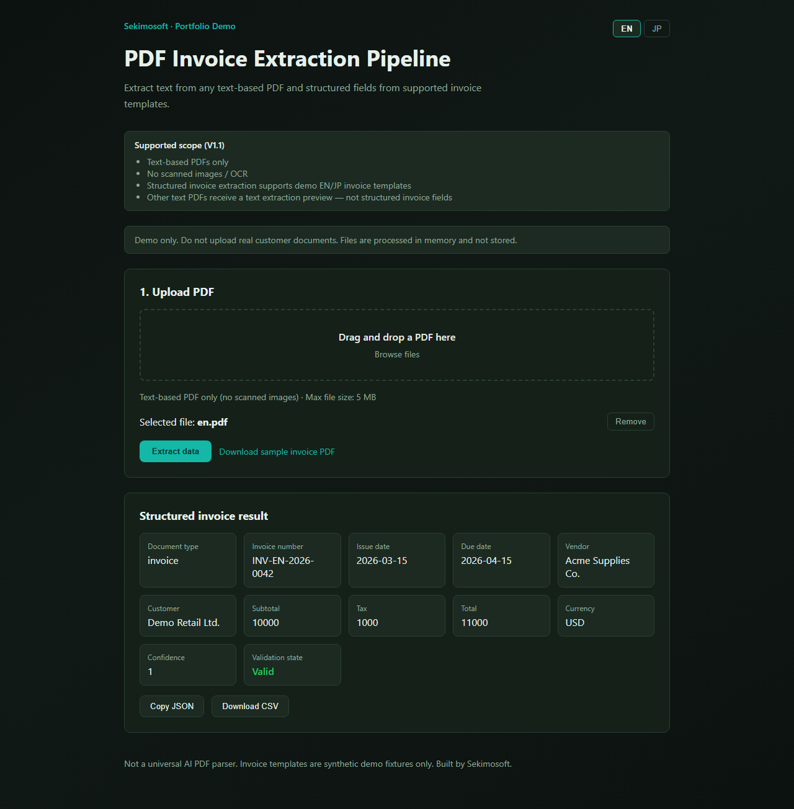
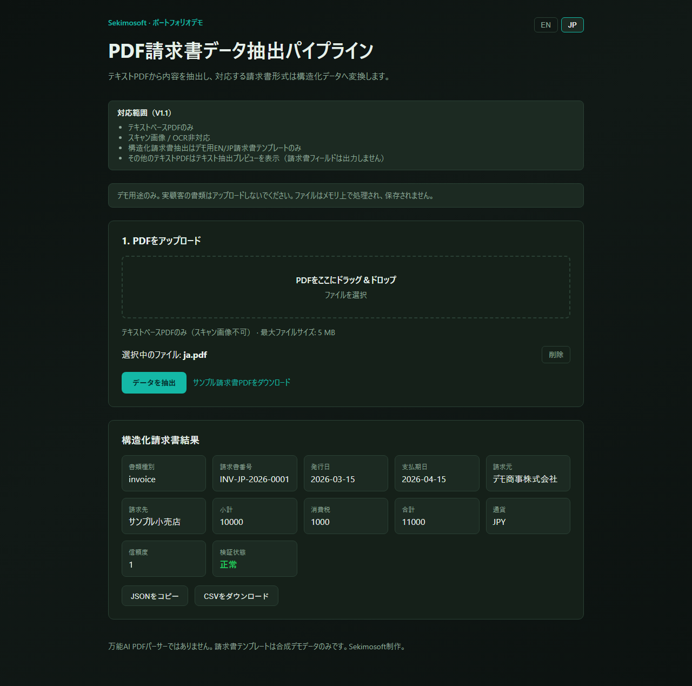
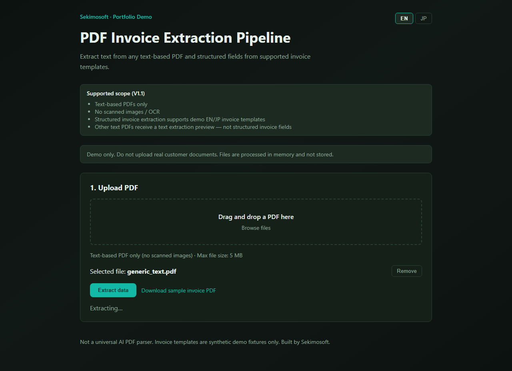

# PDF Invoice Extraction Pipeline

**Extract text from text-based PDFs — and structured invoice fields from supported demo templates.**

Upload a PDF → extract text → if the document matches a supported invoice template, return validated JSON/CSV. Other text PDFs receive a clear text preview instead of a misleading failure.

**Live Demo:** https://pdf-extraction-web.onrender.com  
**API (live):** https://pdf-extraction-api-9bub.onrender.com  
**Status:** v1.1.0 — Public, CI green, Live Demo Active

> **Note:** Render issued a different backend hostname than the service name. See [environment-notes](../../docs/handover/environment-notes.md) before changing env vars.

---

## Business problem

Finance and operations teams receive PDF invoices and other documents, then manually re-type data into spreadsheets or ERP systems. That work is slow, error-prone, and hard to audit.

This demo proves: **PDF in → text extraction always → structured invoice output when the template matches**, with deterministic rules you can test and explain.

---

## Live demo

**URL:** https://pdf-extraction-web.onrender.com

- **Mock / rule-based** — no API keys required
- Download **EN or JP sample invoice PDF** from the UI (matches current locale)
- Non-invoice text PDFs show a **text preview** with page/character counts — not a hard failure
- Do not upload real customer documents

### Verified live behavior (2026-07-10)

| Scenario | Result |
|---|---|
| `GET /api/v1/health` | 200 |
| EN sample download + structured extraction | Success |
| JP sample download + structured extraction | Success (`INV-JP-2026-0001`, `validationState: valid`) |
| Generic text PDF (BI brief) | `text_preview` + unsupported notice |
| Non-PDF upload | HTTP 400 — clear error message |

---

## Screenshots

| EN structured invoice | JP structured invoice | Generic text preview |
|---|---|---|
|  |  |  |

Regenerate after UI changes:

```bash
npx playwright install chromium
node scripts/capture-screenshots.mjs
```

---

## How it works

```text
Upload PDF → Validate → Text extract (pdfplumber) → Suitability check
  ├─ Supported invoice template → Parse → Validate → JSON / CSV
  └─ Other text PDF → Text preview (pages, chars, excerpt) + clear notice
```

---

## Supported document scope (V1.1)

| Supported | Not supported |
|---|---|
| Text-based PDF (selectable text) | Scanned / image-only PDFs |
| Demo EN/JP synthetic invoice templates | Arbitrary invoice layouts |
| Generic text PDF → text preview | OCR |
| Up to 5 MB, 10 pages | Password-protected PDFs |
| Fictional demo data only | Real customer documents |

**Honest scope:** Not a universal AI PDF parser. Structured invoice fields apply only to supported demo templates.

---

## Architecture

| Layer | Technology |
|---|---|
| Frontend | Next.js 15, TypeScript, React 19 |
| Backend | FastAPI, Python 3.12, Pydantic v2 |
| PDF | pdfplumber |
| Storage | None — in-memory only |
| AI / OCR | None |

---

## Key design decisions

| Decision | Why |
|---|---|
| Text-based PDF only | Many business PDFs are text-native; OCR changes proof focus |
| Text preview for non-invoices | Unsupported documents should not look like hard failures |
| EN + JP invoice samples | Invoice workflows matter in both markets; JSON keys stay English |
| Fixtures in `app/fixtures/` | Sample PDFs ship with the app bundle — reliable on Render |
| No file persistence | Demo privacy and simpler deployment |

---

## Security and privacy

- Demo only — do not upload real customer documents
- No persistent storage — PDFs processed in memory and discarded
- Max 5 MB, MIME/extension validation

---

## How to run

```bash
# Backend
cd backend && pip install -r requirements.txt
python app/fixtures/generate_fixtures.py  # optional — PDFs committed in repo
uvicorn app.main:app --reload --port 8000

# Frontend
cd frontend && npm install
echo "NEXT_PUBLIC_API_URL=http://localhost:8000" > .env.local
npm run dev
```

---

## Testing

```bash
cd backend && pytest -v
cd frontend && npm test && npm run lint && npm run build
```

---

Copyright © Sekimosoft. No license is granted for reuse.
